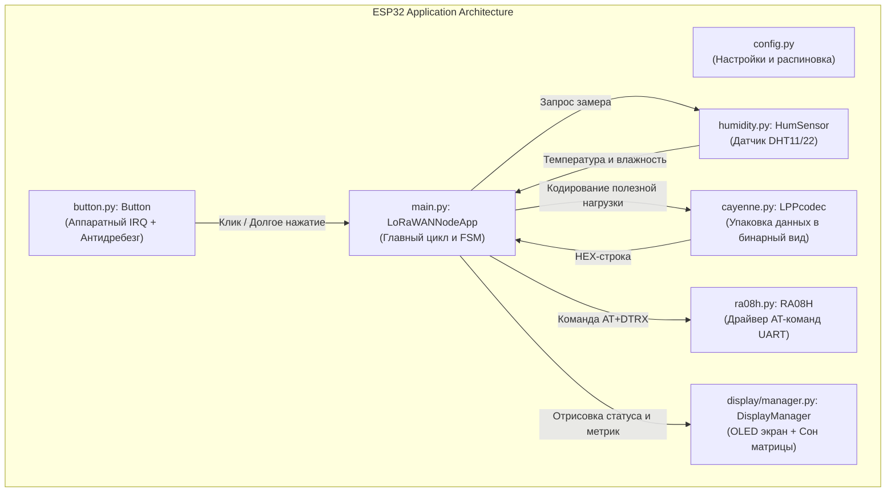

# Полное руководство по кодовой базе проекта ESP32 LoRaWAN Node (RA-08H)

В данном руководстве простым и понятным языком описана структура проекта, архитектура и детальный разбор каждого класса, метода и функции.

---

## 1. Общая архитектура системы

Устройство представляет собой автономную сенсорную ноду (климатический датчик). Микроконтроллер ESP32 периодически опрашивает датчик DHT11/22, сжимает данные в бинарный формат **Cayenne LPP** и отправляет их в сеть **LoRaWAN** через модуль **Ai-Thinker RA-08H**.

---

## 2. Модуль конфигурации: `config.py`

Файл [`config.py`](file:///home/nell/projects/RA-08H/config.py) содержит все параметры прошивки, разделенные на 4 логические группы:

1. **Аппаратные пины и шины:**
   * `UART_ID = 2`, `PIN_UART_TX = 17`, `PIN_UART_RX = 16`, `UART_BAUDRATE = 9600`: настройки связи с радиомодулем RA-08H.
   * `I2C_ID = 0`, `PIN_I2C_SCL = 26`, `PIN_I2C_SDA = 25`, `I2C_FREQ = 400000`: аппаратный I2C для дисплея SSD1306 на частоте 400 кГц.
   * `PIN_BUTTON = 22`: вход тактовой кнопки.
   * `PIN_LED = 14`: выход индикаторного светодиода.
   * `PIN_DHT = 18`: однопроводная шина датчика температуры и влажности.
   * `IS_DHT22 = False`: выбор модели датчика (`False` — DHT11, `True` — DHT22/AM2302).
2. **Параметры LoRaWAN:**
   * `JOIN_MODE = 1`: режим OTAA (активация по воздуху).
   * `DEV_EUI`, `APP_EUI`, `APP_KEY`: 16- и 32-значные шестнадцатеричные ключи устройства. Если оставить пустыми, используются ключи, сохраненные во flash-памяти модема.
   * `DEFAULT_DATARATE = 5`: начальная скорость передачи (DR5 = SF7/125 кГц в регионе EU868/RU864).
   * `CONFIRMED_UPLINK = False`: отправка неподтверждаемых пакетов (экономит заряд батареи и емкость радиоэфира).
   * `TX_POWER_DBM = 14`: мощность передатчика в дБм.
   * `LORA_PORT = 1`: порт LoRaWAN (FPort).
3. **Тайминги и периоды:**
   * `TX_INTERVAL_SEC = 60`: интервал между сеансами связи (60 секунд).
   * `SCREEN_TIMEOUT_SEC = 30`: автовыключение экрана через 30 секунд бездействия для экономии энергии.
   * `BUTTON_DEBOUNCE_MS = 250`, `BUTTON_LONG_PRESS_MS = 2000`: пороги распознавания дребезга и длинного нажатия.
   * `JOIN_MAX_ATTEMPTS = 5`, `JOIN_TIMEOUT_MS = 15000`: лимиты на попытки входа в сеть.
4. **Системные настройки:**
   * `ENABLE_WDT = False`: включение аппаратного сторожевого таймера Watchdog (`True` для автономных полевых условий).

---

## 3. Модуль кнопки: `button.py`

Драйвер [`Button`](file:///home/nell/projects/RA-08H/button.py) предназначен для работы с кнопкой без блокировки процессора.

### Класс `Button`

* **`__init__(pin_num, on_click=None, on_long_press=None, debounce_ms=50, long_press_ms=2000, pull_down=True)`**
  * Инициализирует входной пин с внутренней подтяжкой к земле (`PULL_DOWN`).
  * Настраивает аппаратное прерывание `pin.irq(trigger=Pin.IRQ_RISING | Pin.IRQ_FALLING)` на оба фронта, чтобы измерять время, пока кнопка удерживается нажатой.
* **`_irq_handler(pin)`**
  * Вызывается процессором аппаратно при смене уровня на пине.
  * Если кнопка нажата: фиксирует временную метку начала нажатия `_press_start_time`.
  * Если кнопка отпущена: вычисляет длительность удержания `duration = time.ticks_diff(now, start)`.
  * Если `duration >= debounce_ms`: импульс считается реальным нажатием (а не помехой).
  * Если `duration >= long_press_ms`: фиксируется длинное нажатие. Иначе — короткий клик.
* **`_schedule(callback)` и `_dispatch(callback)`**
  * Передают выполнение пользовательской функции во встроенный планировщик `micropython.schedule()`, чтобы не выполнять пользовательский код внутри аппаратного прерывания (что запрещено в MicroPython).
* **`was_clicked() -> bool`**
  * Возвращает `True`, если с момента прошлого вызова произошел короткий клик, и сбрасывает флаг.
* **`was_long_pressed() -> bool`**
  * Возвращает `True`, если с момента прошлого вызова произошло долгое нажатие (более 2 секунд).
* **`is_held -> bool`**
  * Свойство. Возвращает `True`, если кнопка зажата прямо в данный момент.

---

## 4. Модуль упаковки данных: `cayenne.py`

Формат **Cayenne LPP** упаковывает разнородные показания сенсоров в компактную последовательность байт по правилу: `[Номер канала (1 байт)] + [Тип данных (1 байт)] + [Значение (1..N байт)]`.

### Класс `CayenneLPPType`
Содержит константы стандартных типов данных:
* `TEMPERATURE = 0x67` (2 байта, шаг 0.1 °C, знаковое целое)
* `HUMIDITY = 0x68` (1 байт, шаг 0.5 %, беззнаковое целое)
* `ANALOG_IN = 0x02` (2 байта, шаг 0.01, знаковое целое — для напряжения аккумулятора)
* `VOLTAGE = 0x74` (2 байта, шаг 0.01 В)
* `BAROMETER = 0x73` (2 байта, шаг 0.1 гПа)
* `GPS = 0x88` (9 байт: широта, долгота, высота)

### Класс `LPPcodec`

* **`__init__()` и `reset()`**
  * Инициализируют и сбрасывают внутренний буфер `bytearray`. Повторное использование буфера защищает память от фрагментации.
* **`add_temperature(value: float, channel: int = 1)`**
  * Умножает температуру на 10 и упаковывает через `struct.pack('>BBh', channel, 0x67, raw)`. 
  * Формат `>h` гарантирует правильное представление отрицательных чисел (дополнительный код).
* **`add_humidity(value: float, channel: int = 1)`**
  * Ограничивает диапазон $0..100\%$, умножает на 2 (шаг 0.5%) и упаковывает в 1 байт (`>BBB`).
* **`add_analog_input(value: float, channel: int = 1)`**
  * Умножает значение на 100 и упаковывает как знаковое 16-битное число. Используется для мониторинга батареи.
* **`add_voltage(value: float, channel: int = 1)`**
  * Умножает напряжение на 100 и упаковывает в 2 байта без знака.
* **`to_bytes() -> bytes`**
  * Возвращает полезную нагрузку в виде сырых байт.
* **`to_hex() -> str`**
  * Преобразует бинарный буфер в шестнадцатеричную строку (например, `'016864016700FA'`) для передачи в AT-команду радиомодуля.
* **`encode_humtemp(values, channel=1) -> str`**
  * Хелпер для быстрой упаковки кортежа `(влажность, температура)` в шестнадцатеричную строку.
* **`decode(data) -> list`**
  * Декодирует сырые байты или hex-строку обратно в читаемый список словарей (используется для проверки корректности передачи и тестов).

---

## 5. Модуль датчика климата: `humidity.py`

Класс [`HumSensor`](file:///home/nell/projects/RA-08H/humidity.py) обеспечивает безопасный опрос датчиков DHT11/DHT22.

### Класс `HumSensor` (псевдоним `DHTSensor`)

* **`__init__(pin: int, name='climate', place='node', is_dht22=False)`**
  * Настраивает пин и подключает стандартный драйвер `dht.DHT11` или `dht.DHT22`.
* **`measure(max_retries=3, retry_delay_ms=250) -> bool`**
  * **Защита от частого опроса (Rate Limiting):** если с прошлого замера прошло меньше 2 секунд, физический замер не производится, а возвращается сохраненное значение (предотвращает саморазогрев сенсора).
  * Выполняет до 3 попыток чтения с паузой 250 мс.
  * Если провод отошел или сенсор поврежден, функция не зависает, а выводит предупреждение в консоль и возвращает `False`.
* **Свойства `humidity` и `temp`**
  * Возвращают последнее измеренное значение влажности и температуры с автоматическим вызовом `measure()`.
* **Свойство `humtemp -> tuple[int, int]`**
  * Возвращает пару целых чисел `(влажность, температура)`.
* **`to_json() -> str`**
  * Формирует JSON-строку с текущими показаниями и статусом валидности для передачи в веб или логи.
* **`log -> list`**
  * Возвращает историю последних 50 измерений, сохраненных в кольцевом буфере памяти.

---

## 6. Драйвер радиомодуля LoRaWAN: `ra08h.py`

Класс [`RA08H`](file:///home/nell/projects/RA-08H/ra08h.py) управляет чипом ASR6601 через UART посредством AT-команд.

### Класс `RA08H`

* **`__init__(uart: UART, debug=True)`**
  * Привязывает UART-интерфейс и очищает входной буфер от старых данных.
* **`send_at_command(cmd, timeout_ms=3000, stop_tokens=None) -> list`**
  * Очищает буфер приема и отправляет команду модему с символом `\r`.
  * Читает строки ответа построчно (`readline()`).
  * Если передан список `stop_tokens` (например, `("OK", "ERROR", "+CJOIN:OK")`), чтение останавливается сразу при получении ключевого слова, не дожидаясь окончания общего таймаута. Это обеспечивает максимальное быстродействие.
* **`set_keys(deveui=None, appeui=None, appkey=None) -> bool`**
  * Записывает идентификаторы и ключ шифрования сети: команды `AT+CDEVEUI`, `AT+CAPPEUI`, `AT+CAPPKEY`.
* **`set_datarate(dr: int = 5)`**
  * Выключает адаптивный битрейт `AT+CADR=0` и устанавливает фиксированный Data Rate `AT+CDATARATE=<dr>`.
* **`set_adr(enable=True)`**
  * Включает или выключает автоматическую адаптацию мощности и скорости сетью (`AT+CADR=1/0`).
* **`set_tx_power(power_dbm: int)`**
  * Устанавливает излучаемую мощность передатчика (`AT+CTXP=<power>`).
* **`get_version() -> str`**
  * Запрашивает версию прошивки модема (`AT+CGMR`).
* **`join(timeout_ms=15000) -> tuple[bool, dict]`**
  * Запускает процедуру входа в сеть LoRaWAN (`AT+CJOIN=1,0,0,1`).
  * Ожидает ответа до 15 секунд (типичное время диалога OTAA).
  * Возвращает `(True, {"STATUS": "CJOIN:OK", ...})` при успехе или `(False, ...)` при таймауте/отклонении.
* **`send_data(data_hex, confirmed=False, nbtrials=2, port=1, timeout_ms=12000) -> tuple[bool, dict]`**
  * Формирует команду `AT+DTRX=<confirm>,<trials>,<len>,<payload>`.
  * Передает hex-строку и ожидает подтверждения отправки (`OK+SENT`).
  * **Парсер телеметрии:** находит в ответе модема и извлекает:
    * `rssi` — уровень принимаемого сигнала в дБм.
    * `snr` — отношение сигнал/шум в дБ.
    * `tx_freq`, `rx_freq` — частоты передачи и приема.
    * `RECV` — входящие данные (Downlink payload), если сервер передал команду устройству.

---

## 7. Менеджер дисплея: `display/manager.py`

Класс [`DisplayManager`](file:///home/nell/projects/RA-08H/display/manager.py) инкапсулирует работу с монохромным OLED-экраном 128×64 на базе контроллера SSD1306.

### Класс `DisplayManager`

* **`__init__(i2c, width=128, height=64, timeout_sec=30)`**
  * Инициализирует экран. Если дисплей физически отключен или поврежден провод, драйвер безопасно перехватывает исключение, позволяя ноде работать дальше.
* **`wake()`**
  * Сбрасывает таймер неактивности и подает питание на экран (`oled.poweron()`), если он спал.
* **`check_power_timeout()`**
  * Сравнивает текущее время с временем последней активности. Если прошло более `timeout_sec` секунд, переводит экран в спящий режим (`oled.poweroff()`), защищая OLED-пиксели от выгорания и экономя 15–25 мА тока.
* **`show_splash(title, subtitle)`**
  * Выводит заставку при включении питания.
* **`show_join(attempt, max_attempts, status, msg)`**
  * Отображает номер текущей попытки подключения к сети LoRaWAN и статус ответа модема.
* **`show_telemetry(packet_id, success, log, hum, temp, dr)`**
  * Основной информационный экран: выводит номер пакета, статус отправки (OK/FAIL), температуру, влажность, текущий Data Rate, а также качество радиоканала (RSSI и SNR).
* **`show_message(line1, line2, line3)`**
  * Выводит всплывающее текстовое сообщение (например, при переключении параметров с кнопки).

---

## 8. Главное приложение: `main.py`

Класс [`LoRaWANNodeApp`](file:///home/nell/projects/RA-08H/main.py) связывает все компоненты в единую систему с использованием конечного автомата (FSM).

### Класс `LoRaWANNodeApp`

* **`__init__()`**
  1. Вызывает `gc.collect()` для очистки памяти.
  2. Инициализирует сторожевой таймер `WDT` (если включен в `config.py`).
  3. Настраивает пин индикаторного светодиода.
  4. Инициализирует шину I2C (пробует аппаратный блок, при необходимости откатывается на `SoftI2C`) и экран `DisplayManager`.
  5. Открывает UART и инициализирует радиомодем `RA08H`.
  6. Настраивает датчик `HumSensor` и кодек `LPPcodec`.
  7. Создает обработчик кнопки `Button` с привязкой событий клика и лонг-пресса.
  8. Записывает настройки радиоканала в модем через `_configure_modem()`.
* **`_init_display() -> DisplayManager`**
  * Вспомогательный метод безопасного создания объекта экрана с обработкой ошибок.
* **`_configure_modem()`**
  * Записывает ключи сети, устанавливает битрейт и мощность передачи.
* **`_on_button_click()`**
  * Колбэк короткого клика: пробуждает дисплей, циклически переключает скорость передачи `DataRate` (5 $\to$ 4 $\to$ 3 $\to$ 2 $\to$ 1 $\to$ 0 $\to$ 5), мигает светодиодом и выводит уведомление на дисплей.
* **`_on_button_long_press()`**
  * Колбэк длинного нажатия (более 2 секунд): устанавливает флаг `force_tx_flag = True` для немедленной внеочередной отправки телеметрии.
* **`_blink_led(duration_ms)`**
  * Зажигает сигнальный светодиод на указанное количество миллисекунд.
* **`feed_wdt()`**
  * Сбрасывает сторожевой таймер («кормит сторожевую собаку»), подтверждая, что приложение не зависло.
* **`perform_network_join() -> bool`**
  * Выполняет до `config.JOIN_MAX_ATTEMPTS` попыток подключения к сети. Обновляет экран и мигает светодиодом. При успехе возвращает `True`.
* **`transmit_telemetry()`**
  * Основная рабочая процедура:
    1. Считывает температуру и влажность с `sensor.humtemp`.
    2. Упаковывает их кодеком `codec.encode_humtemp()`.
    3. Отправляет через `lora.send_data()`.
    4. Обновляет экран новыми данными радиосвязи (RSSI, SNR).
    5. Выводит структурированный лог в UART консоль.
    6. Вызывает `gc.collect()` для утилизации временных объектов.
* **`run()`**
  * **Главный неблокирующий цикл:**
    * Сбрасывает Watchdog.
    * Проверяет таймаут отключения экрана.
    * Отслеживает таймер отправки по `time.ticks_diff()` или срабатывание флага `force_tx_flag`.
    * Если подошло время — вызывает `transmit_telemetry()`.
    * Спит 50 мс для снижения энергопотребления процессора.
* **Функция `main()`**
  * Точка входа в программу. Создает экземпляр `LoRaWANNodeApp` и вызывает `run()`.

---

## 9. Автоматические тесты: `tests/test_node.py`

Тестовый модуль позволяет проверять логику работы прямо на компьютере разработчика без физического подключения платы:
* **`TestCayenneLPP`**: проверяет упаковку положительных/отрицательных температур, расчет влажности и полный цикл кодирования/декодирования.
* **`TestRA08HParser`**: проверяет парсер AT-ответов с помощью виртуального класса `MockUART`, имитирующего ответы модема.
* **`TestSensorResilience`**: проверяет, что программный стек датчика стабилен даже при физическом отсутствии оборудования.
